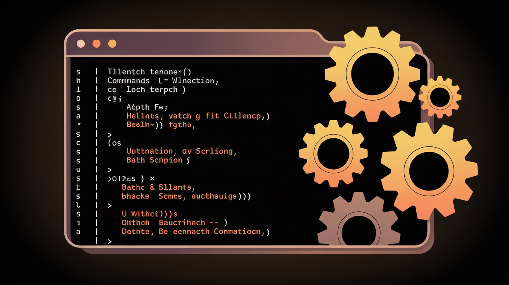

# The Ultimate Bat File - SOTA 2026 Edition 🚀

**The Most Comprehensive Windows System Management Suite**

[](https://opensource.org/licenses/MIT)
[](https://www.microsoft.com/windows)
[](https://github.com/jtgsystems/The-Ultimate-Bat-File)
[](https://docs.microsoft.com/powershell/)

> 🎯 **Professional Windows system management made simple and powerful.**

Created by **John Gallie** of **[JTG Systems](https://www.jtgsystems.com)**

---

## 🌟 What's New in SOTA 2026 Edition (v3.0)

### 🏆 Major Enhancements
- **200+ System Tools** - The most comprehensive collection of Windows utilities
- **PowerShell 7 Support** - Leverages PowerShell 7 for modern Windows features
- **SOTA 2026 Architecture** - Modular, maintainable, and extensible design
- **Professional Logging** - Comprehensive session logging with rotation
- **Smart Error Handling** - Robust error recovery and user-friendly messages
- **Windows 11 Optimized** - Native support for Windows 11 features

### 💎 Core Improvements
- **Modular Menu System** - Clean 20-option main menu with categorized submenus
- **Enhanced System Info** - 18 detailed system information tools
- **Comprehensive Maintenance** - 20+ maintenance and optimization tools
- **Registry Backup/Restore** - Safe registry management with automatic backups
- **System Restore Integration** - Create and manage restore points
- **Service Optimization** - Three levels: Safe, Balanced, Performance

---

## 📋 Features Overview

### 🖥️ System Management (18 Tools)
| Category | Tools |
|----------|-------|
| **Hardware Info** | CPU, Memory, Storage, GPU, Motherboard, BIOS, Temperature, Battery |
| **Software Info** | OS, Updates, .NET, PowerShell, Environment, Uptime, Boot Config |
| **Complete Profile** | Export comprehensive system report |

### 🔧 System Maintenance (20 Tools)
| Category | Tools |
|----------|-------|
| **Quick Fixes** | Quick cleanup, Empty Recycle Bin, Clear Temp, Flush DNS |
| **Disk Tools** | Extended cleanup, Defrag, Check disk errors, Windows Update |
| **Registry** | Backup, Restore, System file check |
| **Services** | Optimize (Safe/Balanced/Performance modes) |
| **Component Store** | Clean WinSxS, Memory diagnostics |
| **Restore Points** | Create, View, System Image backup/restore |

### 🔐 Security Center
- Windows Defender management
- Firewall configuration
- BitLocker controls
- Security policy review
- User Account Control

### 🌐 Network Tools
- WiFi network manager
- Network diagnostics
- Firewall management
- VPN & Proxy settings
- DNS tools

### 💾 Storage Management
- Disk health monitoring
- Storage analysis
- SMART status
- Partition management

### ⚡ Performance Tools
- Real-time performance monitoring
- Service optimization
- Startup management
- Resource monitoring

---

## 🚀 Quick Start

### Prerequisites
- Windows 10/11 or Windows Server 2019/2022
- PowerShell 5.1 or PowerShell 7.0+
- Administrative privileges

### Installation

#### Method 1: Direct Download
1. Download the latest release from [GitHub Releases](https://github.com/jtgsystems/The-Ultimate-Bat-File/releases)
2. Extract to your desired location
3. Right-click `ultimate-tools-SOTA2026.bat` and select "Run as administrator"

#### Method 2: Git Clone
```bash
git clone https://github.com/jtgsystems/The-Ultimate-Bat-File.git
cd The-Ultimate-Bat-File
# Right-click src/core/ultimate-tools-SOTA2026.bat and run as administrator
```

### First Run
1. The script automatically requests administrative privileges
2. System requirements are verified
3. The SOTA 2026 banner displays
4. The main menu appears with 20 options

---

## 📁 Project Structure

```
The-Ultimate-Bat-File/
├── src/
│   ├── core/
│   │   └── ultimate-tools-SOTA2026.bat    # ⭐ Main script (SOTA 2026 Edition)
│   ├── modules/                            # Feature modules
│   │   └── system-info.bat
│   └── utilities/                          # Utility scripts
│       └── system-optimization.bat
├── logs/                                   # Session logs
├── backups/                                # Registry/system backups
├── config/                                 # User configuration
├── README.md                              # This file
└── LICENSE                                # MIT License
```

---

## 🛠️ Usage Guide

### Main Menu Navigation

```
╔══════════════════════════════════════════════════════════════════════════════╗
║                         MAIN MENU - SOTA 2026                                ║
╠══════════════════════════════════════════════════════════════════════════════╣
║   [SYSTEM]                                                                   ║
║    1. System Information        6.  Performance Monitor                      ║
║    2. System Maintenance        7.  Storage Manager                          ║
║    3. Diagnostics Suite         8.  Network Tools                            ║
║    4. Security Center           9.  Windows Features                         ║
║    5. Software Manager          10. Power Settings                           ║
║                                                                              ║
║   [UTILITIES]                                                                ║
║    11. Quick Fixes              14. Backup & Restore                         ║
║    12. WiFi Manager             15. Advanced Tools                           ║
║    13. App Manager              16. Combo Actions                            ║
║                                                                              ║
║   [INFO]                                                                     ║
║    17. View Logs                19. About                                    ║
║    18. Settings                 20. Exit                                     ║
╚══════════════════════════════════════════════════════════════════════════════╝
```

### System Information Example
```
System Information Tools
═══════════════════════════════════════════════════════════════════════════════

Hardware Information:
 1. Complete System Profile   6.  GPU Information
 2. CPU Details               7.  Motherboard Info
 3. Memory Analysis           8.  BIOS Details
 4. Storage Overview          9.  Temperature Sensors
 5. Display Information       10. Battery Status

Software Information:
 11. Operating System         15. Environment Variables
 12. Installed Updates        16. System Uptime
 13. .NET Framework           17. Boot Configuration
 14. PowerShell Version       18. Complete Export
```

---

## ⚙️ Configuration

### User Configuration File
Create `config/user.conf` to customize behavior:

```batch
CONFIG_THEME=dark
CONFIG_VERBOSE=true
CONFIG_AUTO_BACKUP=true
CONFIG_LOG_RETENTION=30
```

### Available Options
| Option | Values | Description |
|--------|--------|-------------|
| `CONFIG_THEME` | dark/light | UI color scheme |
| `CONFIG_VERBOSE` | true/false | Detailed output |
| `CONFIG_AUTO_BACKUP` | true/false | Auto registry backup |
| `CONFIG_LOG_RETENTION` | days | Days to keep logs |

---

## 🔒 Security & Safety

### Administrative Privileges
- Required for all system-level operations
- UAC elevation handled automatically
- All operations logged for audit

### Data Protection
- **Registry Backups** - Created before any registry changes
- **System Restore Points** - Created before major operations
- **Safe Operations** - Destructive actions require confirmation

### Service Optimization Levels
| Level | Description | Best For |
|-------|-------------|----------|
| **Safe** | Non-essential services only | All users |
| **Balanced** | Desktop optimization | Most users |
| **Performance** | Maximum performance | Gaming/Workstations |

---

## 🐛 Troubleshooting

### Common Issues

**"Access Denied" Errors**
```batch
:: Ensure running as administrator
:: Right-click → Run as administrator
```

**PowerShell Execution Policy**
```powershell
# Run as administrator
Set-ExecutionPolicy -ExecutionPolicy RemoteSigned -Scope CurrentUser
```

**WMIC Not Available**
- SOTA 2026 Edition uses PowerShell alternatives
- No manual action required

### Log Files
Logs are saved to `logs/ultimate-tools-YYYYMMDD.log`

---

## 🤝 Contributing

### Development Guidelines
1. **Modular Design** - Add features as separate modules
2. **Error Handling** - Include comprehensive error checking
3. **Logging** - Log all operations appropriately
4. **Documentation** - Document all functions
5. **Testing** - Test on Windows 10/11

---

## 📊 Performance & Compatibility

### System Requirements
| Spec | Minimum | Recommended |
|------|---------|-------------|
| **OS** | Windows 10 | Windows 11 |
| **RAM** | 2GB | 4GB+ |
| **PowerShell** | 5.1 | 7.0+ |
| **Disk** | 100MB | 500MB |

### Compatibility Matrix
| Feature | Win 10 | Win 11 | Server 2022 |
|---------|--------|--------|-------------|
| System Info | ✅ | ✅ | ✅ |
| Maintenance | ✅ | ✅ | ✅ |
| Security Tools | ✅ | ✅ | ✅ |
| Modern Features | ⚠️ | ✅ | ⚠️ |
| PowerShell 7 | ✅ | ✅ | ✅ |

---

## 📈 Roadmap

### Version 3.1 (Next Release)
- [ ] Network troubleshooting wizard
- [ ] Automated maintenance scheduler
- [ ] More Windows 11 specific tools
- [ ] Enhanced GPU monitoring

### Future Versions
- [ ] GUI interface (optional)
- [ ] Remote system management
- [ ] Cloud backup integration
- [ ] Multi-language support

---

## 📄 License

```
MIT License

Copyright (c) 2024-2026 John Gallie - JTG Systems

Permission is hereby granted, free of charge, to any person obtaining a copy
of this software and associated documentation files (the "Software"), to deal
in the Software without restriction...
```

See [LICENSE](LICENSE) for full text.

---

## 💝 Support

### Contact Information
- **Developer**: John Gallie
- **Company**: [JTG Systems](https://www.jtgsystems.com)
- **Phone**: 905-892-4555
- **Issues**: [GitHub Issues](https://github.com/jtgsystems/The-Ultimate-Bat-File/issues)

### Support the Project
- ⭐ Star the repository
- 🐛 Report bugs and suggest features
- 📢 Share with others

---

**© 2024-2026 JTG Systems. All rights reserved.**

*The Ultimate Bat File - SOTA 2026 Edition: Professional Windows system management.*

### SEO Keywords
`windows` `batch` `powershell` `system-administration` `optimization` `maintenance` `diagnostics` `cleanup` `registry` `networking` `firewall` `security` `privacy` `bitlocker` `defender` `updates` `drivers` `monitoring` `performance` `logging` `backup` `restore` `scripting` `automation` `administrator` `configuration` `troubleshooting` `sota-2026`
